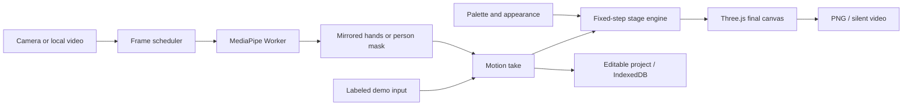

<div align="center">


# Prism Stage

### Your movement. A new medium.

**Perform once. Reimagine the look. Export something entirely yours.**

[Open the studio](https://appleweiping.github.io/prism-stage/) · [中文说明](README.zh-CN.md) · [Watch the workflow](https://appleweiping.github.io/prism-stage/showcase/workflow.mp4) · [Download v1.0.0](https://github.com/appleweiping/prism-stage/releases/tag/v1.0.0)

[](https://github.com/appleweiping/prism-stage/actions/workflows/ci.yml)
[](https://github.com/appleweiping/prism-stage/actions/workflows/pages.yml)


</div>

Prism Stage is an interactive visual art studio that runs on your device. A webcam becomes a drawing instrument, a hand becomes a way to catch physical light, and a person's silhouette becomes a window into a procedural world.

The useful part comes after the performance: **the application records the motion rather than baking its appearance into a video.** Replay a take, change its palette or material, choose a short passage, and render another film. Save an editable `.prismstage` project to return to it later.

No account, API key, Python installation, or inference server is needed. Desktop Chrome and Edge are the supported targets. The studio includes explicit synthetic demo inputs, so it is useful before you grant camera access.

## Three stages, one creative workflow

| Stage | Make it move | Make it yours |
| --- | --- | --- |
| **Ribbon Atelier** | Pinch to draw with either hand; release to finish a stroke; undo the last stroke | Iridescent volumetric ribbons, silk/glass/neon finishes, palette, width, and trail length |
| **Gravity Garden** | Pinch near a sphere to grab it; move and release to throw it; watch actual rigid-body collisions | Celestial light bodies, luminous trails, palettes and surfaces; appearance changes preserve physics |
| **Silhouette Portal** | Move in front of a steady camera; your person mask shapes the portal | Flowing procedural color fields, feathered edges, outline light, palettes, and flow speed |

| Ribbon Atelier | Gravity Garden | Silhouette Portal |
| --- | --- | --- |
|  |  |  |

These are actual 1280 × 720 application exports, made from the included **authored synthetic** example inputs. They are not photographs of webcam tracking. Separately, [validation evidence](docs/VALIDATION.md) records genuine model inference on licensed real videos.

Watch the exported studies: [Ribbon film](https://appleweiping.github.io/prism-stage/showcase/ribbon.webm) · [Gravity film](https://appleweiping.github.io/prism-stage/showcase/gravity.webm) · [Portal film](https://appleweiping.github.io/prism-stage/showcase/portal.webm).

## Make your first study

1. **Choose a stage.** The first screen is a labeled demo, with three visual presets per stage.
2. **Choose an input.** Keep Demo, select **Use camera**, or import a **Local video**. Video decoding and inference stay on your device.
3. **Get comfortable.** Use good lighting and keep your hands visible. For the portal, keep one person clearly framed against the background. The inset shows a mirrored calibration preview.
4. **Record motion.** Press the button or `R`. The stage starts fresh; perform for up to 60 seconds. Finish with the same button. Reaching the limit, reaching the end of a local video, or a source failure stops the take.
5. **Reimagine.** Replay or scrub the take; change the palette, surface, and visual parameters. The same recorded movement drives the result.
6. **Keep or share it.** Save to **My collection**, download the editable project, export a PNG, or choose a passage to export as a silent film.

Three portable examples are also available through **My collection → Open an example**:

- [Aurora ribbon study](public/examples/ribbon.prismstage)
- [Celestial gravity study](public/examples/gravity.prismstage)
- [Inner cosmos portal study](public/examples/portal.prismstage)

### Controls

| Control | Action |
| --- | --- |
| Thumb–index pinch | Draw a ribbon / grab a nearby light sphere |
| Release pinch | End the stroke / release and throw the sphere |
| `R` | Start or finish a motion take |
| `Space` | Play or pause |
| `Ctrl/Cmd + Z` | Undo the last ribbon stroke while creating |
| Timeline | Seek within a captured take |
| 16:9 / 9:16 | Change the view crop; motion and physics coordinates are unchanged |
| Fullscreen | Focus on the stage |

The guide includes a reduced-motion preference: demo autoplay stays paused when
switching stages or inputs, while explicit recording and playback remain available.
Language can be switched between English and Chinese without reloading.

## Run locally

Requires **Node.js 22.12 or newer**. Development and validation used Node 22.21.1 on Windows.

```sh
git clone https://github.com/appleweiping/prism-stage.git
cd prism-stage
npm ci
npm run dev
```

Open the localhost URL printed by Vite. The repository includes the pinned model and WASM files, so normal development does not require downloading model assets from a third-party CDN.

```sh
npm run check       # strict TypeScript and meaningful automated tests
npm run build       # static application, notices, and offline manifest
npm run preview     # serve the production build (including offline support)
npm run examples    # regenerate the three synthetic example projects
npm run assets      # restore/check pinned models and matching WASM files
```

For the full browser acceptance suite, install Chrome (or set `CHROME_PATH`), run
`npm run test:fixtures`, build and leave `npm run preview` running, then run
`npm run test:browser` in another terminal. This uses an isolated browser profile
and licensed local videos; it never opens your physical camera. The suite writes
reports/screenshots and downloads actual canvas films. With FFmpeg on `PATH`
(or `PRISM_FFMPEG` pointing to its executable), `npm run test:media` decodes all six
real-input/showcase films and checks their dimensions, duration and changing frames.

Do not open `index.html` with `file://`: module loading, camera permissions, and service workers need a web origin. Camera access works on localhost; public hosting requires HTTPS.

### Static deployment

The output is `dist/`. No backend service or environment variables are required. Relative asset paths support a GitHub Pages project subdirectory.

The repository's **Publish studio** workflow builds and deploys `main` to GitHub Pages. For a fork, enable **Settings → Pages → Source: GitHub Actions**. A prebuilt static archive is also provided in the release.

## How it works



- **Capture and inference:** `requestVideoFrameCallback` schedules decoded frames. A Worker has at most one inference request in flight, avoiding an ever-growing queue. Only the active stage's model runs. GPU initialization/inference failures can recover through CPU.
- **Stable interaction:** pinch distances are normalized to palm width, with separate enter/exit thresholds and a short confirmation interval. Tracking smooths motion and associates hands by side and wrist position. Missing hands release their interaction. Handedness classification is not presented as per-joint confidence.
- **Rendering:** one WebGL2 renderer supports all stages. Hand inputs address a fixed 12 × 6.75 virtual world. Ribbons use generated cross-section geometry and procedural shading. Rapier supplies gravity, collisions, kinematic grabs, and release velocity. The portal uses an 8-bit person confidence mask to reveal a procedural interior.
- **Replay:** fixed 1/60-second simulation steps, seeded initialization, and versioned input make a take reproducible within this engine version. Seeking reconstructs the stage on the fixed-step grid. Undo counts are part of the take.
- **Appearance:** styling is separate from input. Changing the look during gravity replay does not alter its physical trajectory.

See [architecture and algorithms](docs/ARCHITECTURE.md) and [the project format](docs/PROJECT_FORMAT.md) for implementation details and limits.

## Save movement, not original footage

A `.prismstage` file is a ZIP with a versioned manifest, timed hand observations or binary person masks, visual settings, seed, trim range, aspect, and an optional thumbnail. It contains enough data to replay the generated artwork. Original RGB video and microphone audio are not included.

Projects are saved explicitly to IndexedDB in the current browser and origin. Browser storage can be cleared or evicted; download a project for a portable backup. Import checks file sizes, ZIP expansion limits, CRCs, supported versions, timestamps, data dimensions, and required fields. Failed imports or quota errors do not overwrite a valid saved project.

Version 1 uses one stage per project and takes of up to 60 seconds. Engine versions are checked; it does not silently reinterpret a future version of the physics or input schema.

## Exports

**PNG:** the actual final artwork at 1280 × 720 or 720 × 1280. Controls and the camera calibration inset are outside the exported canvas.

**Film:** the recorded input is replayed in the foreground while `MediaRecorder`
captures a same-size 2D copy of the final artwork canvas. Where supported, frames are explicitly submitted
after rendering with `CanvasCaptureMediaStreamTrack.requestFrame()`, targeting
30 fps; automatic canvas capture is the compatibility fallback. WebM/VP8 is preferred;
the browser's supported MIME determines the actual extension. Preview the result
before downloading. Exports are silent, take real time, and can drop frames on slow
devices. Changing tabs aborts an export rather than silently producing a throttled recording.
The preparation step readies the encoder before advancing the replay timeline,
so cold encoder startup does not consume the opening motion of a short take.

**Editable project:** keeps movement and settings so the same performance can become a different creation. For a project imported from a local video, selecting a new video is necessary to record a new take; the original video is deliberately absent from the project file.

## Privacy and offline use

- Camera access is requested only after **Use camera**. No microphone is requested.
- Local files use browser Blob URLs. Pixels, landmarks, silhouettes, and projects are not uploaded.
- Models, WASM, fonts, and application assets are served from the same origin. The pinned SDK contains a usage logger; a Worker-level same-origin fetch guard blocks external requests before they reach the network. The production page also sets a restrictive content security policy.
- **Make available offline** caches the application, models, fonts, and editable examples (approximately 45 MiB). Only a completed download is labeled offline-ready. Afterward, reopen the same site in the same browser to create, save, and export offline. The separately linked showcase films are optional downloads and are not part of this cache.
- Switching to another browser or domain uses separate storage. An initial uncached visit still needs a connection. Development mode intentionally does not install the production service worker.

Model and dependency sources, hashes, and licenses are included in [third-party notices](THIRD_PARTY_NOTICES.md) and the [asset manifest](public/models/manifest.json).

## Validation and performance

Automated checks cover gesture hysteresis and identity, masks and mirroring, fixed-step Rapier replay, undo, geometry, archive safety and roundtrips, storage failure protection, recording lifecycle, seeking, asynchronous loads, and export recovery.

Browser validation uses actual Google sample videos with recorded license/provenance, checks the production UI and exports, and keeps synthetic display examples distinct from real model evidence. See [the validation report](docs/VALIDATION.md) for measurements, environment, reproduced cases, and remaining limits. Performance is reported for tested conditions rather than inferred from an upstream model benchmark.

The v1.0.0 build passes **80 automated tests and 19 production browser
checks**, including fresh first-export startup, model failure recovery, and
offline real inference. On this Intel Iris Xe machine, ordinary studio rendering
at 720p Auto measured median **56.5 / 59 / 59.5 fps** for ribbon / gravity / portal
during real video inference. Inference itself measured **7.30 / 7.45 / 23.85 fps**; these rates are
distinct from the encoder's output cadence. See the report for cold startup,
measurement conditions, raw samples, and decoded export results.
The [fresh-start regression](docs/fresh-start-validation.json) also verifies
animated opening frames after encoder preparation.

Practical advice: start with **Auto** quality, close other graphics-heavy tabs, keep the camera still, and use a clear view of the hands. A smaller render resolution can improve display responsiveness; exported PNG dimensions remain fixed.

### Troubleshooting

| What you see | What to do |
| --- | --- |
| Camera permission was denied | Allow the camera for this site in the browser and operating-system settings, then select **Retry**. Demo and local-video input remain available. |
| A model or stage could not start | Reconnect if its assets have not been cached, then select **Retry**. Use desktop Chrome/Edge with hardware acceleration for WebGL2. The vision worker attempts CPU recovery after GPU failure. |
| A pinch fails or a stroke breaks | Keep the thumb and index finger visible in good light, move more slowly, and avoid crossing or hiding hands. Release and pinch again to start a new interaction. |
| A saved work is missing or storage is full | Open the same browser and site where it was saved. Download `.prismstage` backups; remove unwanted local works if storage is full. Original source videos must be selected again when recording a new take. |
| A film export fails or contains no frames | Keep the tab visible, close other graphics-heavy tabs, and retry a shorter passage. Save the editable project before retrying; an error does not create a successful film download. |
| The demo is still after a stage change | Check **A quick guide → Reduce motion**. You can explicitly play or record without changing that preference. |

### Known boundaries

- This is an expressive 2.5D/3D art interface, not metric hand-depth measurement or room reconstruction.
- Selfie segmentation is a person/background mask, not individual-person tracking or hair-accurate matting. It can merge people and lose thin fingers, fast movements, or occluded areas.
- The portal creates a generated world inside a silhouette; it does not recover the real background hidden behind a person.
- Fast hand crossings, dim light, off-camera hands, and inference delays can interrupt strokes or grabs.
- Desktop Chrome/Edge are the primary targets. Mobile layout is responsive; mobile camera performance and other browser engines are not promised equivalent support.
- Video exports are foreground, real-time captures, not frame-perfect offline encodes. MP4 support depends on the browser; no fake file extension is used.
- There is no cloud account, multi-user collaboration, audio analysis, or full video editor in v1.

## Research and credits

Nine neighboring projects were studied through their README and core implementation, including Invisible Cloak, vision-demos, AeroPuzzle, AR Cut & Paste, Robust Video Matting, KalidoKit, MindAR, Iron Interface, and Dance Sync Analysis. Their ideas informed the product boundaries and interaction design; the [research comparison](docs/RESEARCH.md) explains what each does, its constraints, licensing, and what Prism Stage learned from it.

Prism Stage's application code and synthetic examples are MIT licensed. Dependencies, model files, fonts, and validation fixtures retain their respective licenses. See [LICENSE](LICENSE) and [THIRD_PARTY_NOTICES.md](THIRD_PARTY_NOTICES.md).

Built by [Weiping Yan](https://github.com/appleweiping).
