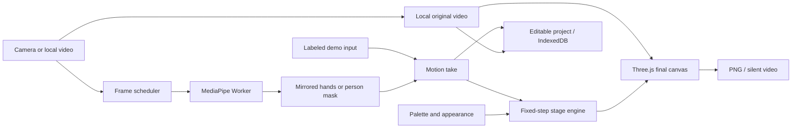

<div align="center">


# Prism Stage

### Your movement. A new medium.

**Perform once. Reimagine the look. Export something entirely yours.**

[Try real footage + effects](https://appleweiping.github.io/prism-stage/?example=real-gravity) · [中文说明](README.zh-CN.md) · [Watch the workflow](https://appleweiping.github.io/prism-stage/showcase/composite-workflow.mp4) · [Download v1.1.0](https://github.com/appleweiping/prism-stage/releases/tag/v1.1.0)

[](https://github.com/appleweiping/prism-stage/actions/workflows/ci.yml)
[](https://github.com/appleweiping/prism-stage/actions/workflows/pages.yml)


</div>

Prism Stage is an interactive visual art studio that runs on your device. **Keep the original person and room in the picture, then create ribbons, physical light, or a silhouette portal over the video.** Camera and local-video input default to this composite view; switch to **Artwork only** for a generated-only artwork.

The application keeps **motion, visual styling, and original footage as separate editable ingredients**. Replay a take, change its palette or material, switch the composition, choose a short passage, and render another film. Save an editable `.prismstage` project to return to the same movement and video later.

No account, API key, Python installation, or inference server is needed. Desktop Chrome and Edge are the supported targets. The studio includes explicit synthetic demo inputs, so it is useful before you grant camera access.

## Three stages, one creative workflow

| Stage | Make it move | Make it yours |
| --- | --- | --- |
| **Ribbon Atelier** | Pinch to draw with either hand, or choose **Follow hands** to grow ribbons from ordinary hand movement; undo the last stroke | Iridescent volumetric ribbons, silk/glass/neon finishes, palette, width, and trail length |
| **Gravity Garden** | Pinch near a sphere to grab it; move and release to throw it; watch actual rigid-body collisions | Celestial light bodies, luminous trails, palettes and surfaces; appearance changes preserve physics |
| **Silhouette Portal** | Move in front of a steady camera; your person mask shapes the portal | Flowing procedural color fields, feathered edges, outline light, palettes, and flow speed |

| Ribbon Atelier | Gravity Garden | Silhouette Portal |
| --- | --- | --- |
|  |  |  |

These are actual 1280 × 720 application exports over licensed original footage. Their inputs come from actual MediaPipe inference. The original source, observations, and visual settings remain separate inside the downloadable projects. Ribbon uses **Follow hands**; these clips contain no confirmed pinch and do not demonstrate pinch drawing or grabbing. See [composite validation](docs/COMPOSITE_VALIDATION.md) for the checks and their limits; the [v1.0 validation](docs/VALIDATION.md) remains separately documented.

Watch the exported composites: [Ribbon film](https://appleweiping.github.io/prism-stage/showcase/real-ribbon.webm) · [Gravity film](https://appleweiping.github.io/prism-stage/showcase/real-gravity.webm) · [Portal film](https://appleweiping.github.io/prism-stage/showcase/real-portal.webm).

## Make your first study

1. **Choose a stage.** The first screen is a labeled demo, with three visual presets per stage.
2. **Choose an input.** Select **Real footage demo** for an immediate editable video example, keep the labeled synthetic Demo, select **Use camera**, or import an MP4/WebM **Local video** up to 96 MiB. Video decoding and inference stay on your device.
3. **Choose the composition.** Real input shows the original person and room with effects by default. Select **Artwork only** for the generated artwork alone. Use good lighting and keep hands visible; the calibration preview and composite share the same mirrored orientation.

   Local-video Ribbon input defaults to **Follow hands**, which works without a
   deliberate pinch. Camera input defaults to **Pinch to draw**. Both controls
   remain available; changing the control during replay reconstructs the ribbon
   from the same actual hand observations. Follow mode does not relabel those
   observations as detected pinches.

4. **Record motion.** Press the button or `R`. Camera recording first prepares a local, silent source-video capture, then starts the motion clock. Perform for up to 60 seconds and finish with the same button. Local-video takes retain the selected source file and their starting offset. Reaching the limit, the source end, or a source failure stops the take.
5. **Reimagine.** Replay or scrub the take; change the palette, surface, and visual parameters. The same recorded movement drives the result.
6. **Keep or share it.** Save to **My collection**, download the editable project, export a PNG, or choose a passage to export as a silent film.

Three portable examples are also available through **My collection → Open an example**:

- [Aurora ribbon study](public/examples/ribbon.prismstage)
- [Celestial gravity study](public/examples/gravity.prismstage)
- [Inner cosmos portal study](public/examples/portal.prismstage)

The v1.1 original-video example projects use Google's licensed MediaPipe gesture
clip: [Ribbon](public/examples/real-ribbon.prismstage), [Gravity](public/examples/real-gravity.prismstage), and
[Portal](public/examples/real-portal.prismstage). Their original video and provenance are described in
[the asset record](docs/validation-assets.json). These are separate from the
synthetic examples above.

### Controls

| Control | Action |
| --- | --- |
| Thumb–index pinch | Draw a ribbon / grab a nearby light sphere |
| Follow hands | Grow ribbons along tracked hand movement without a pinch |
| Release pinch | End the stroke in Pinch to draw mode / release and throw the sphere |
| `R` | Start or finish a motion take |
| `Space` | Play or pause |
| `Ctrl/Cmd + Z` | Undo the last ribbon stroke while creating |
| Timeline | Seek within a captured take |
| 16:9 / 9:16 | Change the view crop; motion and physics coordinates are unchanged |
| You + effects / Artwork only | Show original footage with the effects, or show generated artwork alone |
| Fullscreen | Focus on the stage |

The guide includes a reduced-motion preference: demo autoplay stays paused when
switching stages or inputs, while explicit recording and playback remain available.
Language can be switched between English and Chinese without reloading.

## Run locally

Requires **Node.js 22.12 or newer**. Development and validation used Node 22.21.1 on Windows.

```sh
git clone https://github.com/appleweiping/prism-stage.git
cd prism-stage
npm ci
npm run dev
```

Open the localhost URL printed by Vite. The repository includes the pinned model and WASM files, so normal development does not require downloading model assets from a third-party CDN.

```sh
npm run check       # strict TypeScript and meaningful automated tests
npm run build       # static application, notices, and offline manifest
npm run preview     # serve the production build (including offline support)
npm run examples    # regenerate the three synthetic example projects
npm run assets      # restore/check pinned models and matching WASM files
```

For v1.1 browser acceptance, install Chrome (or set `CHROME_PATH`) and FFmpeg
(on `PATH`, or set `PRISM_FFMPEG`). Run `npm run test:fixtures`, build and leave
`npm run preview` running, then run these jobs sequentially in another terminal:

```sh
npm run test:composite        # real local-video inference, editing, save/reopen, export
npm run test:camera           # native fake-camera capture and retained-video replay
npm run test:composite:media  # fully decode all three published composite films
npm run test:composite:smoke  # packaged examples, storage, portrait and offline workflows
```

The browser jobs use isolated profiles and licensed local videos; they never open
your physical camera. Reports, screenshots, and actual canvas films are written
locally. The historical v1.0 abstract-output harness remains available as
`npm run test:browser` with its six-film decoder `npm run test:media`;
its results are separate from v1.1 composition evidence.

Do not open `index.html` with `file://`: module loading, camera permissions, and service workers need a web origin. Camera access works on localhost; public hosting requires HTTPS.

### Static deployment

The output is `dist/`. No backend service or environment variables are required. Relative asset paths support a GitHub Pages project subdirectory.

The repository's **Publish studio** workflow builds and deploys `main` to GitHub Pages. For a fork, enable **Settings → Pages → Source: GitHub Actions**. A prebuilt static archive is also provided in the release.

## How it works



- **Capture and inference:** `requestVideoFrameCallback` schedules decoded frames. A Worker has at most one inference request in flight, avoiding an ever-growing queue. Only the active stage's model runs. GPU failures or sustained slow inference recover through local CPU mode; the first frame's shader compilation is excluded from the sustained-latency check. CPU recovery improves compatibility and is not a speed guarantee.
- **Stable interaction:** pinch distances are normalized to palm width, with separate enter/exit thresholds and a short confirmation interval. Tracking smooths motion and associates hands by side and wrist position. Missing hands release their interaction. Handedness classification is not presented as per-joint confidence.
- **Rendering:** one WebGL2 renderer combines the video backdrop and effects. The unmirrored source is presented with one mirror and centered cover cropping in the fixed 12 × 6.75 virtual world. Portrait output changes the view crop. Ribbons use generated geometry and shaders; Rapier supplies collisions, grabs, and release velocity; the portal uses an 8-bit person mask.
- **Replay:** fixed 1/60-second simulation steps and seeded initialization reconstruct the effects. A separate local video element replays the retained footage at the take's source offset; seeking waits for its decoded frame. Undo counts remain part of the take.
- **Appearance:** styling is separate from input. Changing the look during gravity replay does not alter its physical trajectory.

See [architecture and algorithms](docs/ARCHITECTURE.md) and [the project format](docs/PROJECT_FORMAT.md) for implementation details and limits.

## Save movement and original footage locally

A `.prismstage` file is a ZIP with a versioned manifest, timed hand observations or binary person masks, visual settings, seed, trim range, aspect, and an optional thumbnail. **Version 2 can include the original video, up to 96 MiB**, together with its source offset and composition mode. Camera takes retain a silent locally captured clip. Imported MP4/WebM files are retained unchanged and may include their original audio tracks; playback and canvas film exports are muted/silent.

An imported file is retained in full, including footage outside the selected take or trim. Sharing a v2 project shares that source file. Switching to Artwork only changes the visible composition and does not remove retained footage from the editable project.

Projects are saved explicitly to IndexedDB in the current browser and origin. Browser storage can be cleared or evicted; download a project for a portable backup. Import checks file sizes, ZIP expansion limits, CRCs, supported versions, timestamps, data dimensions, and required fields. Failed imports or quota errors do not overwrite a valid saved project.

Both formats use one stage per project and takes of up to 60 seconds. Existing version-1 projects remain compatible as abstract artwork and contain no original footage. Engine versions are checked; the format change does not change recorded physics.

## Exports

**PNG:** the actual final composition at 1280 × 720 or 720 × 1280, including original footage when Video composition is selected. Controls and the camera calibration inset stay outside the exported canvas.

**Film:** the recorded input is replayed in the foreground while `MediaRecorder`
captures a same-size 2D copy of the final artwork canvas. Where supported, frames are explicitly submitted
after rendering with `CanvasCaptureMediaStreamTrack.requestFrame()`, targeting
30 fps; automatic canvas capture is the compatibility fallback. WebM/VP8 is preferred;
the browser's supported MIME determines the actual extension. Preview the result
before downloading. Exports are silent, take real time, and can drop frames on slow
devices. Changing tabs aborts an export rather than silently producing a throttled recording.
The preparation step readies the encoder before advancing the replay timeline,
so cold encoder startup does not consume the opening motion of a short take.

**Editable project:** keeps movement, settings, and any retained original video so the same performance can become a different creation. Older v1 projects contain only the generated-art inputs.

## Privacy and offline use

- Camera access is requested only after **Use camera**. No microphone is requested.
- Local files use browser Blob URLs. Pixels, landmarks, silhouettes, and projects are not uploaded. Camera takes capture silent original video locally; imported files may already contain audio and are preserved unchanged inside v2 projects.
- Models, WASM, fonts, and application assets are served from the same origin. The pinned SDK contains a usage logger; a Worker-level same-origin fetch guard blocks external requests before they reach the network. The production page also sets a restrictive content security policy.
- **Make available offline** caches the application, models, fonts, and bundled editable examples. The offline preparation UI reports the current bundle size and only a completed download is labeled offline-ready. Afterward, reopen the same site in the same browser to create, save, and export offline. The separately linked showcase films are optional downloads and are not part of this cache.
- Switching to another browser or domain uses separate storage. An initial uncached visit still needs a connection. Development mode intentionally does not install the production service worker.

Model and dependency sources, hashes, and licenses are included in [third-party notices](THIRD_PARTY_NOTICES.md) and the [asset manifest](public/models/manifest.json).

## Validation and performance

The v1.1 automated suites cover gesture hysteresis and identity, masks and mirroring, fixed-step Rapier replay, undo, geometry, archive safety and roundtrips, storage failure protection, recording lifecycle, seeking, asynchronous loads, and export recovery.

Browser validation uses actual Google sample videos with recorded license/provenance, checks the production UI and exports, and keeps synthetic display examples distinct from real model evidence. The [v1.1 composite report](docs/COMPOSITE_VALIDATION.md) records three completed local-video workflows, complete decoding of their silent 1280 × 720 films, and a separate camera capture/save/reopen/export workflow. Exact builds and limitations are recorded there. Performance is reported for tested conditions rather than inferred from an upstream model benchmark.

The historical v1.0.0 build passed **80 automated tests and 19 production browser
checks**, including fresh first-export startup, model failure recovery, and
offline real inference. On this Intel Iris Xe machine, ordinary studio rendering
at 720p Auto measured median **56.5 / 59 / 59.5 fps** for ribbon / gravity / portal
during real video inference. Inference itself measured **7.30 / 7.45 / 23.85 fps**; these rates are
distinct from the encoder's output cadence. See the report for cold startup,
measurement conditions, raw samples, and decoded export results.
The [fresh-start regression](docs/fresh-start-validation.json) also verifies
animated opening frames after encoder preparation.
Those measurements concern abstract output. They are not performance or
acceptance claims for v1.1 video compositing and local source-video capture;
the v1.1 workflows above provide separate functional evidence, without reusing
these historical performance figures.

Practical advice: start with **Auto** quality, close other graphics-heavy tabs, keep the camera still, and use a clear view of the hands. A smaller render resolution can improve display responsiveness; exported PNG dimensions remain fixed.

### Troubleshooting

| What you see | What to do |
| --- | --- |
| Camera permission was denied | Allow the camera for this site in the browser and operating-system settings, then select **Retry**. Demo and local-video input remain available. |
| A model or stage could not start | Reconnect if its assets have not been cached, then select **Retry**. Use desktop Chrome/Edge with hardware acceleration for WebGL2. The vision worker attempts CPU recovery after GPU failure. |
| A pinch fails or a stroke breaks | Keep the thumb and index finger visible in good light, move more slowly, and avoid crossing or hiding hands. Release and pinch again to start a new interaction. |
| A saved work is missing or storage is full | Open the same browser and site where it was saved. Download `.prismstage` backups; remove unwanted local works if storage is full. Retained video makes v2 projects larger. |
| A film export fails or contains no frames | Keep the tab visible, close other graphics-heavy tabs, and retry a shorter passage. Save the editable project before retrying; an error does not create a successful film download. |
| The demo is still after a stage change | Check **A quick guide → Reduce motion**. You can explicitly play or record without changing that preference. |

### Known boundaries

- Effects are layered over video in an expressive 2.5D/3D view. There is no SLAM, room reconstruction, persistent world anchoring, or automatic occlusion by furniture or the person's body.
- Selfie segmentation is a person/background mask, not individual-person tracking or hair-accurate matting. It can merge people and lose thin fingers, fast movements, or occluded areas.
- The portal creates a generated world inside a silhouette; it does not recover the real background hidden behind a person.
- Fast hand crossings, dim light, off-camera hands, and inference delays can interrupt strokes or grabs.
- Desktop Chrome/Edge are the primary targets. Mobile layout is responsive; mobile camera performance and other browser engines are not promised equivalent support.
- Video exports are foreground, real-time captures, not frame-perfect offline encodes. MP4 support depends on the browser; no fake file extension is used.
- There is no cloud account, multi-user collaboration, audio analysis, or full video editor in v1.

## Research and credits

Nine neighboring projects were studied through their README and core implementation, including Invisible Cloak, vision-demos, AeroPuzzle, AR Cut & Paste, Robust Video Matting, KalidoKit, MindAR, Iron Interface, and Dance Sync Analysis. Their ideas informed the product boundaries and interaction design; the [research comparison](docs/RESEARCH.md) explains what each does, its constraints, licensing, and what Prism Stage learned from it.

Prism Stage's application code and synthetic examples are MIT licensed. Dependencies, model files, fonts, and validation fixtures retain their respective licenses. See [LICENSE](LICENSE) and [THIRD_PARTY_NOTICES.md](THIRD_PARTY_NOTICES.md).

Built by [Weiping Yan](https://github.com/appleweiping).
