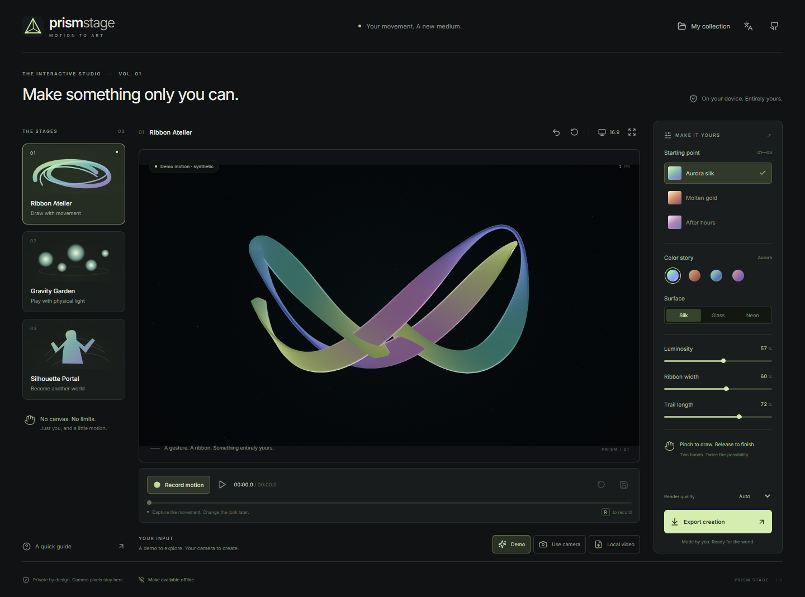
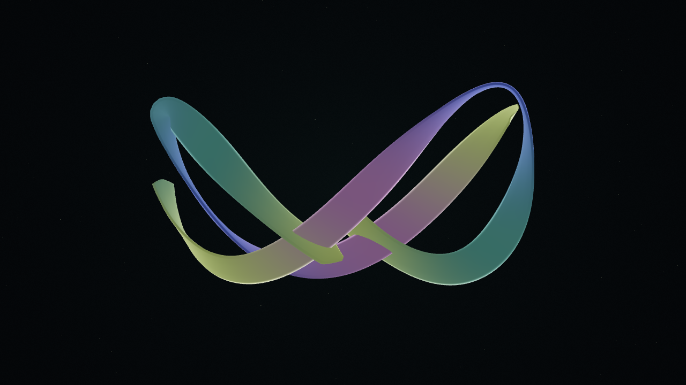
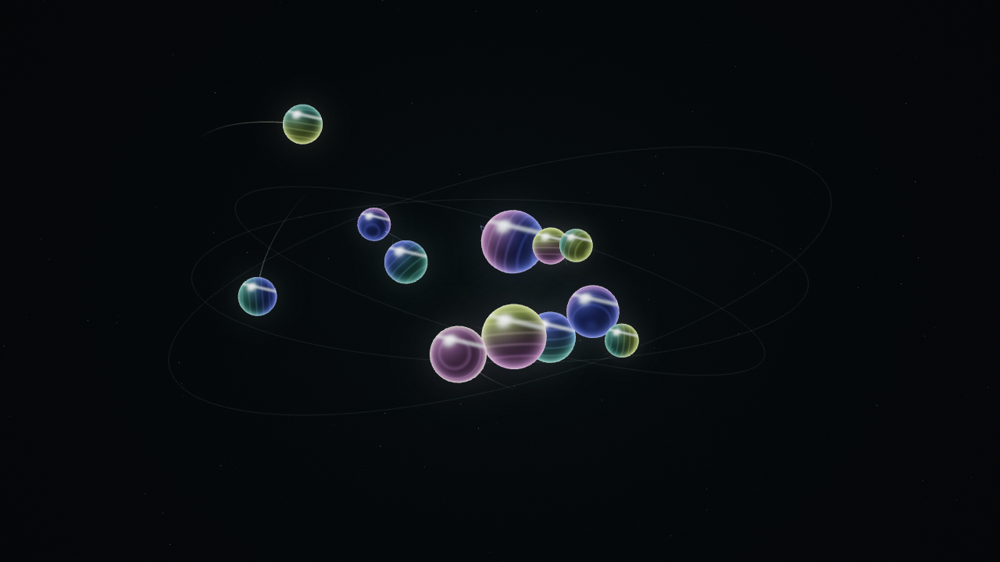
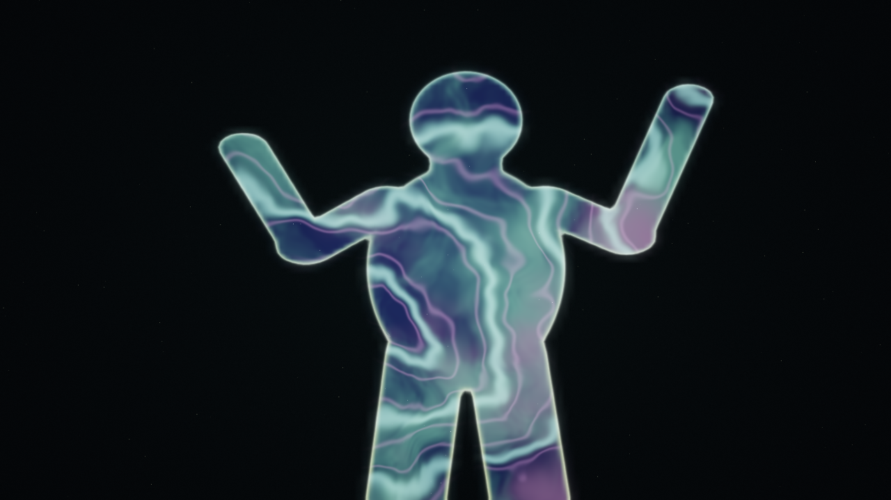
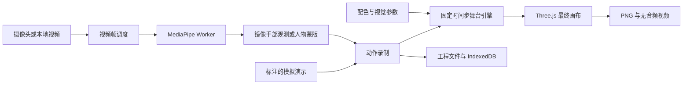

<div align="center">


# Prism Stage

### 让动作，成为新的创作媒介。

**录下一次表演，重新设计外观，导出独属于你的作品。**

[打开在线工作室](https://appleweiping.github.io/prism-stage/) · [English](README.md) · [观看创作流程](https://appleweiping.github.io/prism-stage/showcase/workflow.mp4) · [下载 v1.0.0](https://github.com/appleweiping/prism-stage/releases/tag/v1.0.0)



</div>

Prism Stage 是一个在浏览器本地运行的交互视觉创作工作室。摄像头成为绘画工具，手势可以抓住与抛出光球，身体轮廓可以成为另一个世界的窗口。

它会**记录动作，而不把视觉效果永久烘焙进一段视频**。录制完成后，你可以回放、更换配色与材质、截取片段，再次输出不同风格的成片。下载 `.prismstage` 工程，就能在以后继续编辑。

无需账号、API key、Python 环境或推理服务器。正式支持桌面 Chrome 与 Edge；明确标注的模拟演示让你在开启摄像头前就能探索效果。

## 三个舞台，一个完整创作流程

| 舞台 | 怎样互动 | 可以调整什么 |
| --- | --- | --- |
| **光带工坊 Ribbon Atelier** | 双手捏合绘制，松手结束笔画，撤销上一笔 | 有体积的虹彩光带、绸缎/玻璃/霓虹材质、色彩、宽度与拖尾 |
| **引力花园 Gravity Garden** | 在光球附近捏合抓取，移动后松手抛出，观察真实刚体碰撞 | 发光球体、运动光迹、配色与材质；外观修改不会改变物理轨迹 |
| **轮廓之门 Silhouette Portal** | 在稳定镜头前移动，以人物蒙版塑造传送门 | 程序化流动世界、羽化边缘、轮廓光、色彩与流速 |

| 光带工坊 | 引力花园 | 轮廓之门 |
| --- | --- | --- |
|  |  |  |

以上为应用实际导出的 1280 × 720 画面，输入来自随项目提供、明确标注的**人工编排模拟示例**。真实人物视频的模型识别结果单独记录在[验收报告](docs/VALIDATION.md)，两类证据不混用。

观看导出的作品：[光带短片](https://appleweiping.github.io/prism-stage/showcase/ribbon.webm) · [引力短片](https://appleweiping.github.io/prism-stage/showcase/gravity.webm) · [轮廓短片](https://appleweiping.github.io/prism-stage/showcase/portal.webm)。

## 一分钟开始创作

1. **选择舞台。** 首屏展示标注为演示的动作，每个舞台提供三套视觉预设；开启减少动效时暂停自动播放。
2. **选择输入。** 保持演示模式，或点击“开启摄像头”，或导入“本地视频”。视频解码和模型推理均在本机进行。
3. **调整位置。** 使用充足光线，让双手清晰地出现在镜头内。轮廓模式尽量只保留一名主体。右下角小窗提供镜像校准预览。
4. **录制动作。** 点击按钮或按 `R`，舞台从初始状态开始。最长录制 60 秒，再次点击结束。本地视频播放完、达到时长上限或输入失败时会停止录制。
5. **重新设计。** 回放或拖动时间线，更换色彩、材质和视觉参数，使用同一段动作创作新版本。
6. **保存与导出。** 将工程保存到“我的作品”，下载可编辑工程，导出 PNG，或截取片段输出无音频短片。

也可以通过“我的作品 → 打开示例”使用三个完整工程：

- [极光光带](public/examples/ribbon.prismstage)
- [天体花园](public/examples/gravity.prismstage)
- [身体宇宙](public/examples/portal.prismstage)

### 手势与快捷键

| 控制 | 功能 |
| --- | --- |
| 拇指与食指捏合 | 绘制光带 / 抓取附近光球 |
| 松开捏合 | 结束笔画 / 松手抛出光球 |
| `R` | 开始或结束录制 |
| `Space` | 播放或暂停 |
| `Ctrl/Cmd + Z` | 创作时撤销上一条光带 |
| 时间线 | 定位已录制动作 |
| 16:9 / 9:16 | 改变取景裁切，保持动作与物理坐标不变 |
| 全屏 | 专注查看作品 |

使用指南中提供“减少动效”设置：切换舞台或输入源后，演示仍保持暂停自动播放，
同时允许主动录制与播放。中英文界面可以即时切换。

## 本地运行

需要 **Node.js 22.12 或更新版本**。开发与验收环境使用 Windows、Node 22.21.1。

```sh
git clone https://github.com/appleweiping/prism-stage.git
cd prism-stage
npm ci
npm run dev
```

打开 Vite 输出的 localhost 地址。固定版本的模型与 WASM 文件已随仓库提供，正常开发不依赖第三方模型 CDN。

```sh
npm run check       # 严格 TypeScript 检查与自动测试
npm run build       # 构建静态站点、许可文件与离线清单
npm run preview     # 预览生产版本，包括离线功能
npm run examples    # 重新生成三套模拟示例工程
npm run assets      # 恢复并校验固定版本模型与匹配的 WASM
```

要运行完整浏览器验收，先安装 Chrome（或通过 `CHROME_PATH` 指定路径），运行
`npm run test:fixtures`，构建并保持 `npm run preview` 运行，再在另一终端运行
`npm run test:browser`。它使用独立浏览器配置和有许可的本地测试视频，不会访问你的
实体摄像头。测试会生成报告、截图和实际导出的短片。安装 FFmpeg 并放入 `PATH`
（或用 `PRISM_FFMPEG` 指定可执行文件）后，运行 `npm run test:media`，可完整解码
六段真实输入／展示视频，检查尺寸、时长和画面变化。

不要用 `file://` 双击打开 HTML。模块加载、摄像头和 Service Worker 需要网页运行环境。开发时可用 localhost，正式部署需要 HTTPS。

### 部署

构建输出位于 `dist/`，无需后端或环境变量。相对资源路径支持 GitHub Pages 的项目子目录。

仓库中的 **Publish studio** 工作流会将 `main` 构建发布到 GitHub Pages。Fork 后选择 **Settings → Pages → Source: GitHub Actions**。Release 也提供预构建静态站点压缩包。

## 架构与算法



- **输入与推理：** 使用 `requestVideoFrameCallback` 调度已解码视频帧。每个 Worker 最多一个在途推理请求，避免旧帧不断排队。按舞台运行手部或分割模型；GPU 初始化或推理失败可恢复到 CPU。
- **稳定交互：** 捏合距离按掌宽归一化，使用不同的进入/退出阈值、短暂确认、轨迹平滑以及基于左右手与腕部位置的身份关联。丢手时释放交互，不把左右手分类分数冒充关节置信度。
- **渲染：** 共用一个 WebGL2 渲染器。手部映射到固定 12 × 6.75 虚拟世界；光带使用生成几何与程序化着色；Rapier 实现重力、碰撞、抓取和释放速度；轮廓舞台使用 8 位人物置信度蒙版。
- **回放：** 固定 1/60 秒模拟步长，保存初始随机种子与实际使用的输入。拖动时间线时按固定帧网格重建状态，撤销次数也保存在动作数据中。
- **动作与外观分离：** 配色和材质变化不影响引力舞台的物理轨迹，同一段动作可以输出不同视觉版本。

详细说明见[架构文档](docs/ARCHITECTURE.md)与[工程格式](docs/PROJECT_FORMAT.md)。

## 保存与工程格式

`.prismstage` 是一个 ZIP 工程包，包含版本化清单、带时间戳的手部观测或二进制人物蒙版、视觉参数、随机种子、裁切区间、画面比例及可选缩略图。它足以回放生成的作品，**不包含原始 RGB 视频或麦克风音频**。

作品库通过 IndexedDB 显式保存在当前浏览器、当前站点。浏览器数据可能被清理或回收，因此建议下载工程作为便携备份。导入会检查文件与展开大小、CRC、版本、时间戳、数据尺寸及必要字段；导入失败或配额不足不会覆盖已有有效工程。

V1 每个工程包含一个舞台，最长 60 秒，并校验引擎版本。来自本地视频的工程不保存原视频，若要录制新动作，需要重新选择本地视频或演示输入。

## 导出

**静态 PNG：** 导出真正的最终作品画布，尺寸为 1280 × 720 或 720 × 1280。操作面板和摄像头校准小窗不进入成片。

**动态短片：** 前台回放已录制输入，通过 `MediaRecorder` 捕获最终作品画布的同尺寸 2D 副本。支持时在渲染后
显式调用 `CanvasCaptureMediaStreamTrack.requestFrame()` 提交画面，目标 30 fps；
其他情况下回退到自动 canvas 采集。优先 WebM/VP8，根据浏览器实际支持的 MIME 决定
扩展名。可以先预览，再下载。

视频无音频，以实时速度导出；较慢设备可能掉帧。切换到后台会中止导出，避免悄悄得到被后台节流影响的长视频。它不是严格逐帧的离线编码器。
导出准备阶段会等待真实编码器就绪，再推进回放时间线，避免冷启动耗时截掉短片开头的动作。

**可编辑工程：** 保存动作和设置，方便以后更换外观并再次导出。

## 隐私与离线

- 点击“开启摄像头”之后才请求权限，不请求麦克风。
- 本地文件通过浏览器 Blob URL 使用，像素、关键点、轮廓和工程不会上传。
- 模型、WASM、字体和应用资源同源托管。固定版本 SDK 含有用量日志功能，Worker 中的同源请求门禁在请求发出前拦截外部地址；生产页面还设置了内容安全策略。
- 点击“准备离线使用”会缓存应用、模型、字体和可编辑示例，约 45 MiB。下载完成后才显示离线就绪，此后可在同一浏览器重新打开站点，完成创作、保存和导出。单独链接的展示短片属于可选下载，不包含在这份缓存中。
- 换浏览器或域名会使用不同的存储空间。首次访问尚未缓存的站点仍然需要网络。开发模式不安装生产版 Service Worker。

模型、依赖来源、哈希与许可证见[第三方声明](THIRD_PARTY_NOTICES.md)和[资源清单](public/models/manifest.json)。

## 验收与性能

自动测试覆盖捏合迟滞、手部身份、蒙版与镜像、Rapier 固定步回放、撤销、几何、工程包安全与往返保存、存储失败保护、录制生命周期、时间线定位、并发加载和导出恢复。

浏览器验证使用有许可与来源记录的 Google 真实视频，检查生产界面、模型输入、保存与导出，并将模拟展示样例与真实识别证据分开记录。设备、测试条件、具体测量与尚未覆盖的边界见[验收报告](docs/VALIDATION.md)。性能结论来自测试条件，不直接套用上游模型跑分。

v1.0.0 构建通过 **80 项自动测试和 19 项生产浏览器检查**，覆盖首次导出冷启动、模型失败恢复和离线真实识别。
在本机 Intel Iris Xe 上，720p 自动画质、普通工作室界面中运行真实视频识别的光带／引力／轮廓渲染
中位数为 **56.5／59／59.5 fps**，识别速率中位数为 **7.30／7.45／23.85 fps**。
渲染、识别和视频编码帧率是不同指标；冷启动耗时、测量条件、原始记录及实际导出
结果均见验收报告。
[首次导出回归报告](docs/fresh-start-validation.json)还检查了编码准备完成后的成片开头确实包含动画。

建议先使用“自动”画质，关闭其他占用图形资源的标签页，保持镜头稳定。降低显示渲染分辨率可以提高响应，PNG 导出仍保持规定尺寸。

### 常见问题

| 遇到的情况 | 处理方式 |
| --- | --- |
| 摄像头权限被拒绝 | 在浏览器和操作系统设置中允许本站使用摄像头，再点击“重试”。也可以继续使用演示或本地视频。 |
| 模型或舞台无法启动 | 如果尚未完整缓存资源，恢复联网后点击“重试”。使用开启硬件加速的桌面 Chrome/Edge 运行 WebGL2；视觉 Worker 在 GPU 失败后会尝试 CPU 恢复。 |
| 捏合不响应、笔画中断 | 保持光线充足，让拇指与食指清晰可见，放慢动作并避免遮挡或双手交叉。松手后重新捏合即可开始新交互。 |
| 找不到作品或本地存储已满 | 使用保存时的同一浏览器和站点。下载 `.prismstage` 作为备份，必要时移除不需要的本地作品。从视频工程开始新录制时，需重新选择原始视频。 |
| 视频导出失败或没有画面 | 保持标签页在前台，关闭其他占用图形资源的页面，尝试较短片段。先保存可编辑工程；出现错误时不会生成标为成功的短片下载。 |
| 切换舞台后演示没有动起来 | 检查“一分钟上手 → 减少动效”。该偏好会在切换舞台、输入源后保留，仍可主动播放或录制。 |

### 已知边界

- 手部空间深度是用于艺术创作的虚拟映射，不是精确深度测量或房间重建。
- 人物分割不是逐人追踪或发丝级抠像，可能合并多人，也可能丢失细小手指、快速动作或被遮挡部分。
- 轮廓内部呈现程序化世界，不恢复人物背后被遮住的真实背景。
- 暗光、快速交叉、手部离开画面或推理延迟可能中断绘制与抓取。
- 正式目标是桌面 Chrome/Edge。移动端布局可适配，但手机摄像头性能和其他浏览器引擎不承诺同等支持。
- 视频导出依赖前台实时捕获；MP4 是否支持由浏览器决定，不使用虚假的文件扩展名。
- V1 不包含云端账号、多人协作、音频分析和完整视频剪辑器。

## 调研与致谢

阅读并比较了 Invisible Cloak、vision-demos、AeroPuzzle、AR Cut & Paste、Robust Video Matting、KalidoKit、MindAR、Iron Interface 与 Dance Sync Analysis 九个相邻项目的 README 和关键实现。[调研对照文档](docs/RESEARCH.md)记录了各项目机制、限制、许可及对本项目的启发。

Prism Stage 原创应用代码与模拟示例使用 MIT。第三方依赖、模型、字体和验证素材遵循各自许可证，见 [LICENSE](LICENSE) 与 [THIRD_PARTY_NOTICES.md](THIRD_PARTY_NOTICES.md)。

作者：[Weiping Yan](https://github.com/appleweiping)。
