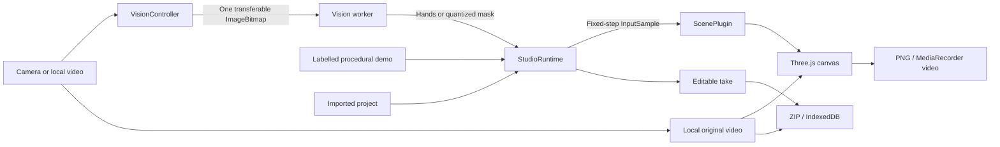

# Architecture

Prism Stage is a static React/TypeScript application with three creative stages. MediaPipe runs in a browser worker, Three.js combines original video and effects in a single canvas, and the runtime turns observations into editable takes. Real input defaults to video composition; abstract composition shows only generated artwork. There is no application server, account system, upload endpoint, or paid inference API.

## Data flow and ownership

| Component | Responsibility |
| --- | --- |
| `App` | Bilingual studio controls, parameter presets, source selection, library, and status presentation. |
| `StudioRuntime` | Live/recording/replay/export states, the fixed-step clock, undo counts, trim, seeking, and orchestration. |
| `VisionController` | Device permission, local video decoding, frame scheduling, worker lifecycle, GPU/CPU recovery, and input cleanup. |
| `TakeVideo` | Independent retained-video playback, finite recorded-WebM duration discovery, cancellable seeking, and silent camera-take capture with encoder readiness. It does not own or stop the live input stream. |
| `vision.worker` | One scene-relevant model, model inference, hand stabilization, copied/quantized masks, and transferable result delivery. |
| `StageEngine` | One Three.js WebGL renderer, video backdrop and composition mode, orthographic camera, shared atmosphere, scene switching, rendering resolution, and disposal. |
| `ScenePlugin` | `update`, `setParams`, `reset`, optional `undo`, and `dispose`; receives observations and never accesses the camera. |
| Storage/export modules | Validated editable ZIP files, explicit IndexedDB saves, flattened artwork downloads, and recorder cleanup. |

The public contracts are [types.ts](../src/core/types.ts). File format details are in [PROJECT_FORMAT.md](PROJECT_FORMAT.md).

The video exporter copies only the final WebGL artwork into a same-size, opaque
2D composition canvas. This gives capture a stable surface independently of the
WebGL renderer's backing store. It uses a zero-rate canvas stream and explicit
[`requestFrame()`](https://developer.mozilla.org/en-US/docs/Web/API/CanvasCaptureMediaStreamTrack/requestFrame)
after rendered frames, throttled toward 30 fps. A browser without manual
frame support receives a fresh automatic 30 fps stream instead. The final renderer
remains the export pixel source: in video composition it already includes the
original footage and effects. Controls and the separate calibration inset are outside it.

WebM/VP8 is preferred when advertised. Format support is a capability hint,
not a guarantee that a particular capture will produce encoded frames. Completed
exports are checked for nonempty data, and validation decodes the resulting media.

## Vision pipeline

Camera capture requests video only, ideally 1280×720 at 30 fps. Local MP4/WebM files use a browser object URL and decoder; the retained source has a 96 MiB limit. A decoded frame is resized to fit 640×360 before transfer to the model. This inference copy is independent from the full original video used as a scene texture and optional v2 project resource.

`VisionController` uses `requestVideoFrameCallback` when available and a `requestAnimationFrame` fallback. At most one frame is in flight. Busy periods skip incoming frames rather than queuing an increasing delay. Each bitmap is transferred to the worker and closed after processing. Session IDs invalidate replaced inputs; a separate epoch invalidates results after video seeking. Model timestamps remain monotonically increasing even when source media time jumps backward.

Camera observation timestamps share a stable `performance.now()` origin exposed
by `VisionController.clockOriginSeconds`. Model initialization and CPU recovery
do not reset it. After raw-video encoder preparation, the runtime subtracts the
exact recording-start offset from this source clock. Observations submitted
before that start are discarded; delayed inference keeps its original frame
time instead of being relabeled with its arrival time.

Ribbons and gravity instantiate **Hand Landmarker** with two hands. Portal instantiates only **Image Segmenter** with the landscape selfie model. Models and the MediaPipe module-WASM files are requested from the application origin. Initialization first attempts GPU; initialization/runtime errors trigger a fresh CPU worker. Initialization and frame timeouts produce recoverable errors. Stopping an input terminates its worker, cancels frame callbacks, stops camera tracks, clears the video, and revokes its object URL.

The controller also recovers to CPU after two consecutive GPU observations take
over 400 ms, excluding the first frame's shader compilation. The replacement CPU
worker processes the currently decoded frame even if a finite video ended during
the slow observation. This is a usability fallback, not a speed guarantee; the
backend remains CPU for that input session instead of oscillating. Camera clock
origin and recorded observation times remain unchanged.

The MediaPipe 1.0.1 SDK was observed attempting periodic telemetry requests to `odml.pa.googleapis.com/v1/log`. Prism Stage does **not** assume the upstream SDK is network-silent: the worker installs `makeLocalFetch` before model initialization, rejecting cross-origin fetches before they reach the network. Same-origin model/WASM requests remain allowed. The production content security policy provides an additional connection restriction. This gate is covered by tests; inspect network traffic during real inference when changing SDK versions. Original pixels are still needed locally for inference, but neither those frames nor their source video are uploaded.

### Hand observations become controls

The hand tracker applies a small, inspectable state machine:

1. Reject nonfinite or incomplete landmarks and consider at most two hands.
2. Associate the two possible tracks by wrist distance to a velocity-predicted location. MediaPipe handedness is a soft cost, not an absolute identity rule. Association history uses a measured inference budget bounded between 600 and 1,500 ms, so a slow valid inference does not always create a new identity; backward timestamps reset stale history. An explicit no-hand result immediately releases interaction, independent of that association window.
3. Compute the thumb-tip/index-tip separation divided by the index-MCP/pinky-MCP palm width. Distances account for image aspect ratio.
4. Close below a ratio of 0.34; remain closed until the ratio reaches 0.56. A transition requires at least two observations and 40 ms.
5. Smooth the midpoint using `alpha = 1 - exp(-dt / 0.045)`, mirror x once, and clamp the output. Derive artistic depth from apparent palm size and clamp it to ±0.35.
6. Omit missing hands from the output. Scenes then end strokes or release grabs; no disconnected hand is allowed to hold an object indefinitely.

Association expiry normally stays at 600 ms. The Worker supplies measured hand
inference duration so slow, valid observations can use a bounded grace period of
`max(600, min(1500, 2 * inferenceMs + 100))` ms. This preserves a held gesture
across measured processing delays without changing pinch thresholds. An explicit
empty detection still releases immediately, and an unexplained long gap with a
fast model retains the normal expiry. Slow inference still feels slower.

These are application-level heuristics, not a newly trained gesture recognizer. Identity can still be ambiguous during full overlap or occlusion. Bright, even lighting and prominent, unobstructed hands help the upstream model. The UI's pinch strength comes from geometry rather than handedness confidence.

### Person masks

The worker copies a person confidence tensor while the MediaPipe callback owns it, mirrors it once, and quantizes `[0, 1]` to unsigned bytes. The current output is at most 256×144. The worker returns this mask rather than a copy of the full RGB source; the renderer obtains its original-video texture separately. This is a low-resolution segmentation effect, not fine-grained video matting; thin fingers, hair, blur, occlusion, and distant subjects can produce imperfect edges. See the linked model cards in [Third-party notices](../THIRD_PARTY_NOTICES.md).

## Rendering the stages

The simulation world is 12×6.75 units. A fixed-height orthographic camera changes its horizontal crop for portrait output; hand mapping, forces, and object positions remain unchanged. The renderer uses an opaque background, sRGB output, ACES tone mapping, and a preserved drawing buffer for artwork export. One renderer survives stage switches. Scene geometry, shader materials, textures, and Rapier worlds have explicit owners and disposal paths.

Original video is stored unmirrored and displayed with exactly one mirror to
match the mirrored model observations. The backdrop is centered and cover-cropped
to the fixed 12×6.75 stage; changing output aspect changes the camera crop rather
than the physical world. Generated objects are layered over footage. The
application does not perform SLAM, reconstruct room geometry, anchor objects to
real-world surfaces, or infer depth occlusion by people and furniture.

| Stage | Implementation |
| --- | --- |
| **Ribbon Atelier** | Each active pinching hand extends a volumetric ribbon built from flattened ten-vertex rings along a path. Tangents, twist, surface normals, and a tapered start give it thickness. Original shaders implement silk, glass, and neon looks; point birth times control trail fading. Width changes rebuild geometry from the stored path. The scene bounds memory to 32 strokes of at most 720 points each, continues long strokes in a new segment, and evicts the oldest stroke when full. Undo removes the latest stroke. |
| **Gravity Garden** | Rapier simulates twelve seeded rigid spheres in a bounded volume at 1/60 second steps. A weak central force, damping, and restitution maintain a drifting garden. Pinch near a sphere acquires an exclusive kinematic grab, preserving the initial offset. Release returns it to a dynamic body with smoothed, capped hand-derived velocity. Missing hands release immediately. The ball meshes, halos, and trails follow the bodies; appearance parameters do not alter their colliders or physical constants. |
| **Silhouette Portal** | A reusable single-channel `DataTexture` holds the latest mask. The shader samples neighboring probabilities, softens the threshold, estimates an edge glow, and clips a seeded procedural interior of noise, bands, filaments, and stars. The artwork uses the silhouette as a window. It does not reconstruct unseen scenery or require a colored cloth. |

Automatic quality changes canvas resolution only, leaving the input and physics timestep intact. It starts at full resolution and can step down to 0.82 or 0.65 after sustained slow rendering. Balanced and low select these scales directly. Exports temporarily render at full requested dimensions. GPU capability, thermal throttling, and the browser's encoder still determine achievable frame rate; the quality mechanism is not a hardware-independent FPS guarantee.

## Record, reinterpret, export

The runtime advances a fixed `1 / 60` simulation clock inside `requestAnimationFrame`. Hand scenes record the processed input at each simulation step. Portal records distinct received masks, with timestamps; replay holds each sample until the next one. A take stops at 60 seconds. The default procedural demonstration has explicit demo provenance and runs independently of inference; starting real input never substitutes demo observations for failed recognition.

Camera recording also keeps a local, silent original-video clip. `TakeVideo`
draws the live video unmirrored to an aspect-preserving canvas bounded by
1280×720, with a 30 fps target. Encoder preparation runs before the motion clock
starts. Finishing the source recording flushes its Blob before the runtime can
stop the input stream. `TakeVideo` never pauses or stops an externally owned
camera/video source. Cancellation releases the capture RAF and encoder tracks.

Imported files are retained as their original bytes instead of being recorded
again. The v2 manifest stores video metadata and a source-time offset for the
take. Replay uses a separate muted video element, leaving vision input ownership
independent. Seeking waits for a decoded frame; replacing a source or disposing
the helper rejects pending load/seek work and revokes its object URL. Recorded
WebM can lack a finite duration header; native seeking discovers its buffered
end and restores time zero before attachment completes.

Seeking resets the active scene to its seed and simulates forward using recorded samples. Cumulative undo counts apply each recorded undo exactly once. Project settings preserve engine version and fixed timestep. The current v1 physical constants are not user-editable, so changing a palette or material during replay cannot silently change gravity's physical setup. A trimmed export simulates the preceding portion to arrive at the correct start state.

The recorder captures the final canvas at a requested 30 fps, without microphone audio. It probes VP8 WebM, VP9 WebM, generic WebM, then MP4 and uses the actual supported MIME/container extension. Export is performed in real time in the foreground. Hiding the tab, cancelling, encoder failure, empty output, or failure to finish rejects the export and releases capture tracks. Browser encoding can make output duration and cadence approximate; verify decoded media when publishing a benchmark or demo.

Each rendered artwork frame is copied to a dedicated opaque 2D canvas with fixed export dimensions. Its capture track uses explicit frame requests where available, with automatic 30 fps capture as the fallback. Before advancing the take, a disposable recorder repeatedly captures the artwork's initial frame until it produces substantive output, bounded by a 15-second timeout. Its chunks are discarded; a new recorder uses the same prepared stream for the actual take. This separates cold encoder initialization from the motion timeline without including a warm-up sequence in the result. Cancellation also releases preparation timers and settles the waiting export.

## Offline assets and build boundary

`npm run assets` obtains two version-1 Google model files, copies the exact MediaPipe 1.0.1 WASM distribution, and writes asset byte counts and SHA-256 hashes into `public/models/manifest.json`. Existing model hashes are checked on subsequent setup runs. Fonts come from the pinned local Inter package. Vite bundles application code and worker modules; production deployment must include models, WASM, fonts, and sample projects under the same base URL.

Offline support uses a production service worker. The UI asks it to prepare required assets and displays readiness only after the cache reports completion. Development mode deliberately reports offline support as unavailable. First-use networking for assets is distinct from inference: camera pixels and locally imported footage are not sent to a service. Cache storage and the explicitly saved IndexedDB project library are separate and can both be removed by browser site-data controls.

Version-2 project ZIPs and IndexedDB records can contain the original RGB video,
up to 96 MiB. Imported MP4/WebM bytes can include existing audio even though app
playback is muted and exported canvas films have no audio track. The full imported
file remains in the project, including material outside a selected trim;
sharing the project shares that footage. Selecting abstract composition does not
delete its retained source. Version-1 projects remain readable without inventing
the original footage they never contained. Licensed public composite examples
and their footage have explicit source attribution; personal input remains local.

## Verification boundaries

Algorithm tests cover gesture thresholds, association, missing input, and mask mirroring. Archive tests verify hand/mask roundtrips, engine compatibility, corruption, resource bounds, and failure-safe local saves. Recorder unit tests cover format selection and lifecycle failures; they do not prove a real hardware encoder produces playable media.

Before publishing a release, run the full typecheck and tests, exercise real video through the actual worker/model, decode exported clips, inspect all three stages, and test denied permission, model failure, offline reopen, and repeated scene changes. Report measured device/browser details separately from targets. No result from the synthetic demo should be reported as a model-accuracy test.

The existing v1.0 evidence covers abstract rendering. It does not establish v1.1
source-video synchronization, composite exports, retained-media privacy, or the
cost of simultaneous camera capture. Those paths require new-build evidence,
including saved-project reopen and seek, original-byte preservation, and decoded
composite films. Historical benchmark numbers retain their original conditions.
